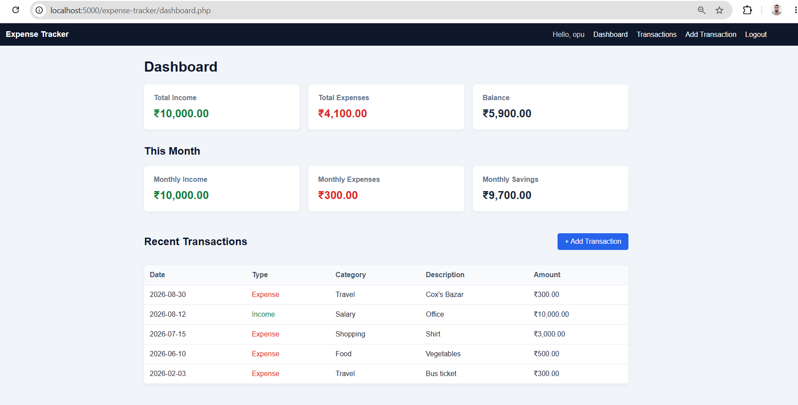
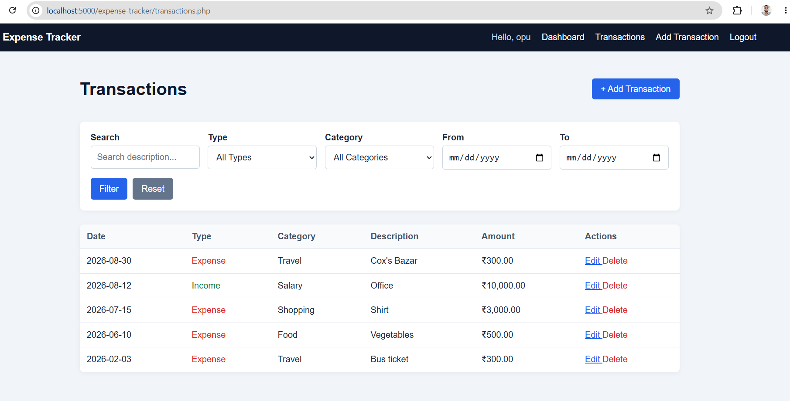
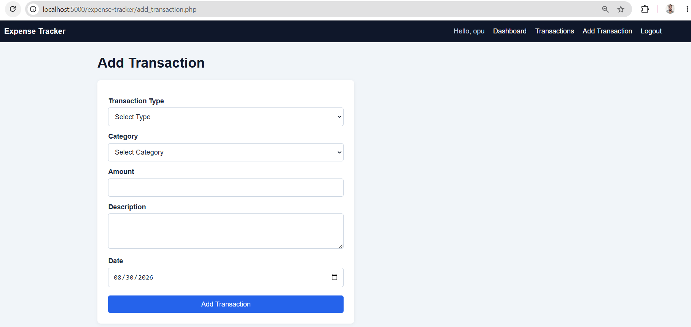
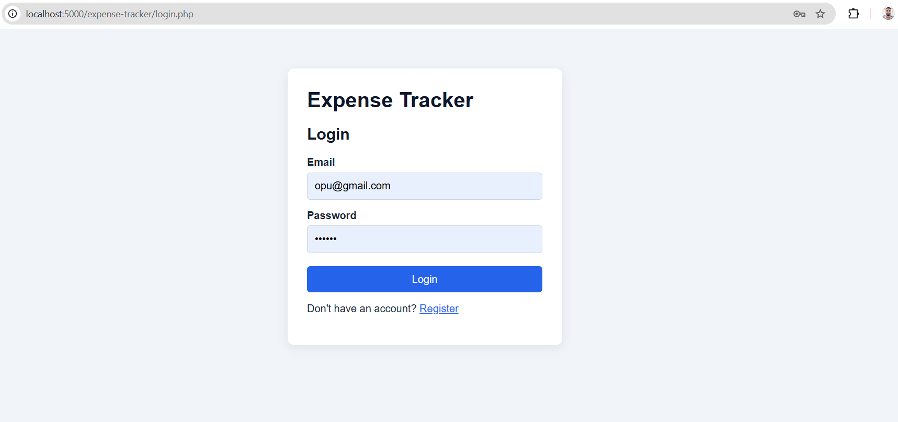

# Student Expense Tracker

A full-stack web application for students to track income and expenses, built using HTML, CSS, JavaScript, PHP and MySQL.

The application allows users to create an account, securely log in, manage personal financial transactions, search and filter transaction history, and view financial summaries.


## Live Demo

[View Live Demo](https://student-expense-tracker.free.nf/)

## Screenshots

### Dashboard



### Transactions



### Add Transaction



### Login




## Features

- User registration and login
- Secure password hashing
- PHP session-based authentication
- Add income and expenses
- View transaction history
- Edit transactions
- Delete transactions
- Transaction categories
- Search transactions
- Filter by transaction type
- Filter by category
- Filter by date range
- Total income calculation
- Total expense calculation
- Current balance calculation
- Monthly income and expense summaries
- Responsive user interface
- User-specific transaction authorization
- CSRF protection for state-changing forms

## Tech Stack

Frontend:
- HTML5
- CSS3
- Vanilla JavaScript

Backend:
- PHP

Database:
- MySQL / MariaDB

Development Environment:
- XAMPP

Version Control:
- Git and GitHub

## Database Structure

The application uses three main tables:

- `users` - stores user accounts
- `categories` - stores transaction categories
- `transactions` - stores income and expense records

Relationships:

- One user can have many transactions.
- One category can be associated with many transactions.
- Each transaction belongs to one user and one category.

## Security

The project demonstrates several basic web security practices:

- Passwords are stored using `password_hash()`.
- Passwords are checked using `password_verify()`.
- PDO prepared statements are used for database queries containing user input.
- PHP sessions are used for authentication.
- Session IDs are regenerated after successful login.
- CSRF tokens protect state-changing forms.
- Output is escaped with `htmlspecialchars()` where appropriate.
- Server-side validation is applied to submitted data.
- Transaction ownership is checked before editing or deleting records.

## Installation

### Requirements

Install:

- XAMPP
- PHP
- MySQL/MariaDB
- A web browser

### 1. Clone the repository

```bash
git clone https://github.com/Mahmudul-Opu/student-expense-tracker.git